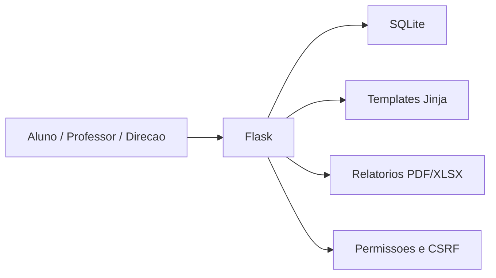

# SERE

Sistema de Evolucao e Engajamento Estudantil.

O SERE ajuda escolas a acompanhar desempenho, evolucao, metas, intervencoes e relatorios em um so painel.

> Pitch: A SERE e uma plataforma escolar que transforma notas, participacao, evolucao e intervencoes em um painel claro para alunos, professores e direcao acompanharem desempenho e merito.

## Demo online

O projeto esta pronto para deploy no Render usando `render.yaml`.

URL sugerida:

```text
https://sere-demo.onrender.com
```

Guia: [docs/DEPLOY_RENDER.md](docs/DEPLOY_RENDER.md)

## Imagens

As imagens abaixo sao capturas da fase de prototipo visual. A demo atual removeu o modulo competitivo individual e foca na experiencia institucional.


## Funcionalidades

- Pagina inicial institucional.
- Login com permissoes de aluno, professor e direcao.
- Dashboard do aluno com indice SERE, metas, prioridade pedagogica e comparativo de turma.
- Dashboard institucional para professor/direcao.
- Perfil publico de aluno para usuarios logados.
- Ranking geral e por turma.
- Perfil completo de turma.
- Reconhecimentos, conquistas, metas e historico.
- Recomendacoes com mini prova de comprovacao.
- Rotina semanal baseada em tempo livre e prioridade pedagogica.
- Intervencoes pedagogicas com responsavel, prazo e status.
- Relatorios PDF e Excel.
- Exportacao `Relatorio SERE.xlsx` com abas de resumo, ranking, turmas, alunos, metas, intervencoes e atencao.
- Painel de gestao com fluxo de aprovacao para limitar alteracoes feitas por professores.
- Preferencias de tema e idioma.

## Arquitetura



Detalhes: [docs/ARCHITECTURE.md](docs/ARCHITECTURE.md)

## Estrutura

```text
SERE/
  app.py
  database.py
  reporting.py
  security.py
  render.yaml
  runtime.txt
  docs/
  sere/
    services/
  static/
  templates/
  tests/
  tools/
  archive/             # prototipos antigos fora do produto principal
```

## Rodar localmente

```bash
pip install -r requirements.txt
python app.py
```

Abra:

```text
http://127.0.0.1:5000
```

## Testes

```bash
python -m unittest discover -s tests
```

## Antes de publicar no GitHub

O projeto ja inclui `.gitignore` para evitar commit de banco local, cache Python, `.env` e rascunhos fora do produto principal.

Nao publique:

- `sere.db`
- `__pycache__/`
- `.env`
- arquivos pessoais ou experimentais dentro de `archive/` e `tools/documentos/`

## Variaveis de ambiente

Use `.env.example` como referencia:

- `SECRET_KEY`
- `SERE_COOKIE_SECURE`
- `SERE_DB_PATH`
- `SERE_ADMIN_PASSWORD`
- `SERE_PROFESSOR_PASSWORD`
- `SERE_ALUNO_PASSWORD`

## Roadmap

Resumo:

- Deploy online.
- Melhorar responsividade mobile.
- Separar `app.py` em blueprints.
- Migrar SQLite para PostgreSQL.
- Backups automaticos.
- Logs de auditoria mais completos.

Detalhes: [docs/ROADMAP.md](docs/ROADMAP.md)
