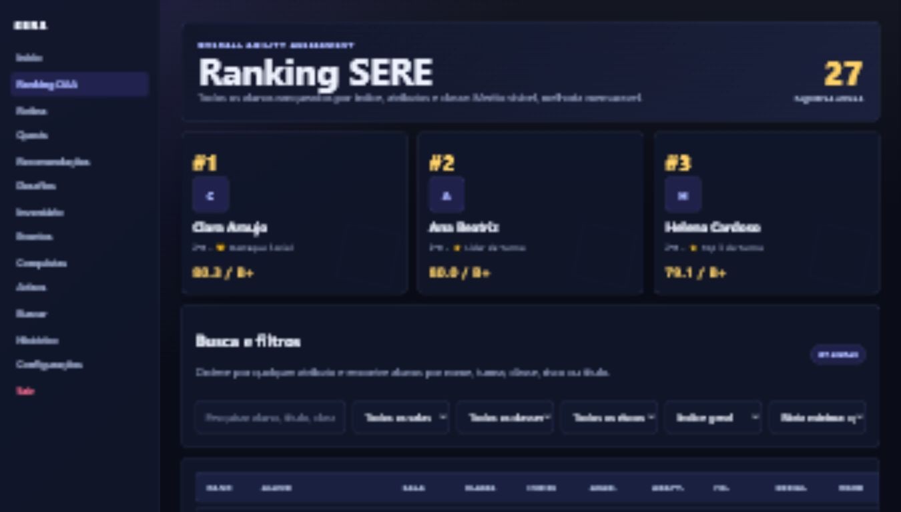
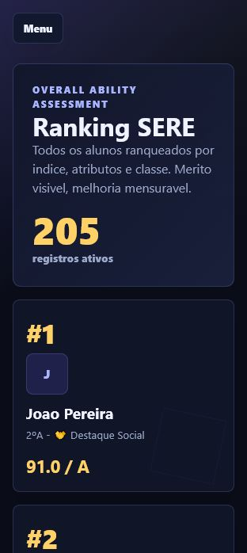
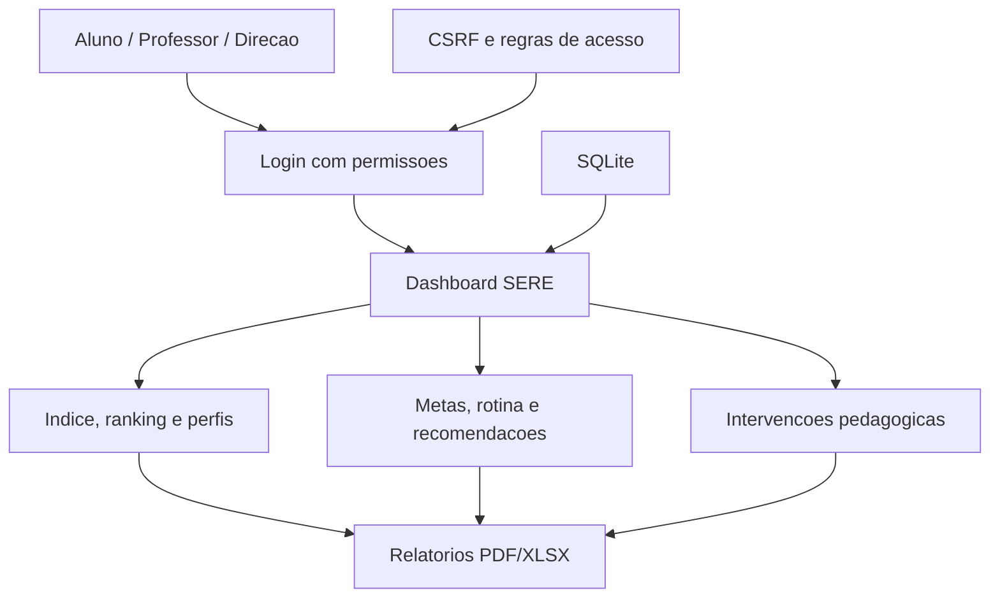

# SERE


Sistema de Evolucao e Engajamento Estudantil.

O SERE e uma plataforma escolar que centraliza desempenho, evolucao, metas, rotina de estudos, intervencoes pedagogicas e relatorios em um painel unico para alunos, professores e direcao.

> Pitch: A SERE e uma plataforma escolar que transforma notas, participacao, evolucao e intervencoes em um painel claro para alunos, professores e direcao acompanharem desempenho e merito.

## Visao simples

Escolas normalmente acompanham notas, comportamento, participacao e dificuldades em lugares separados. O SERE junta esses dados em uma experiencia unica:

```text
Dados do aluno -> Indice SERE -> Ranking e perfil -> Metas e rotina -> Intervencoes -> Relatorios
```

O objetivo nao e apenas ranquear alunos. A ideia principal e mostrar onde cada estudante pode melhorar e dar ferramentas para professor e direcao acompanharem essa evolucao.

## Demo online

O projeto esta pronto para deploy no Render usando `render.yaml`.

URL sugerida:

```text
https://sere-demo.onrender.com
```

Guia: [docs/DEPLOY_RENDER.md](docs/DEPLOY_RENDER.md)

## Imagens

As imagens abaixo sao capturas da fase de prototipo visual. A demo atual foca na experiencia institucional, com acompanhamento pedagogico e relatorios.




## Funcionalidades

- Pagina inicial institucional.
- Login com permissoes de aluno, professor e direcao.
- Dashboard do aluno com indice SERE, metas, prioridade pedagogica e comparativo de turma.
- Dashboard institucional para professor/direcao.
- Perfil publico de aluno para usuarios logados.
- Ranking geral e por turma.
- Perfil completo de turma.
- Reconhecimentos, conquistas, metas e historico.
- Recomendacoes com mini prova de comprovacao.
- Rotina semanal baseada em tempo livre e prioridade pedagogica.
- Intervencoes pedagogicas com responsavel, prazo e status.
- Relatorios PDF e Excel.
- Exportacao `Relatorio SERE.xlsx` com abas de resumo, ranking, turmas, alunos, metas, intervencoes e atencao.
- Painel de gestao com fluxo de aprovacao para limitar alteracoes feitas por professores.
- Preferencias de tema e idioma.

## Exemplo de uso

Um aluno entra na plataforma e visualiza:

```text
Aluno: Mariana Costa
Turma: 2B
Indice SERE: 77.7
Nivel: B+
Risco pedagogico: Estavel
Prioridade: manter evolucao academica e melhorar consistencia social
```

A partir disso, o SERE pode gerar metas, rotina semanal, recomendacoes e planos de intervencao quando houver queda de desempenho.

## Estado atual

| Area | Status |
| --- | --- |
| Login por perfil | Implementado |
| Dashboard do aluno | Implementado |
| Ranking e perfil publico | Implementado |
| Rotina de estudos | Implementado |
| Intervencoes pedagogicas | Implementado |
| Relatorios PDF/XLSX | Implementado |
| Testes automatizados | 15 testes passando |
| Deploy Render | Configurado |

## Arquitetura



Detalhes: [docs/ARCHITECTURE.md](docs/ARCHITECTURE.md)

## Estrutura

```text
SERE/
  app.py
  database.py
  reporting.py
  security.py
  render.yaml
  runtime.txt
  docs/
  sere/
    services/
  static/
  templates/
  tests/
```

## Rodar localmente

```bash
pip install -r requirements.txt
python app.py
```

Abra:

```text
http://127.0.0.1:5000
```

## Acessos de demo

Use estes acessos apenas em desenvolvimento local:

```text
Direcao:   admin.sere / trocar-admin-dev
Professor: professor / trocar-professor-dev
Aluno:     aluno.demo / trocar-aluno-dev
```

Em deploy publico, configure senhas proprias nas variaveis `SERE_ADMIN_PASSWORD`, `SERE_PROFESSOR_PASSWORD` e `SERE_ALUNO_PASSWORD`.

## Testes

```bash
python -m unittest discover -s tests
```

## Higiene do repositorio

O projeto inclui `.gitignore` para manter fora do repositorio arquivos locais, dados sensiveis e artefatos gerados em desenvolvimento.

Arquivos que nao devem ser versionados:

- `sere.db`
- `__pycache__/`
- `.env`
- arquivos pessoais, temporarios ou experimentais fora do produto principal

## Variaveis de ambiente

Use `.env.example` como referencia:

- `SECRET_KEY`
- `SERE_COOKIE_SECURE`
- `SERE_DB_PATH`
- `SERE_ADMIN_PASSWORD`
- `SERE_PROFESSOR_PASSWORD`
- `SERE_ALUNO_PASSWORD`

## Roadmap

Resumo:

- Deploy online.
- Melhorar responsividade mobile.
- Separar `app.py` em blueprints.
- Migrar SQLite para PostgreSQL.
- Backups automaticos.
- Logs de auditoria mais completos.

Detalhes: [docs/ROADMAP.md](docs/ROADMAP.md)

Espero que esteja pelo menos ok, é meu primeiro projeto, espero que gostem!
(aceito criticas sem problemas)
