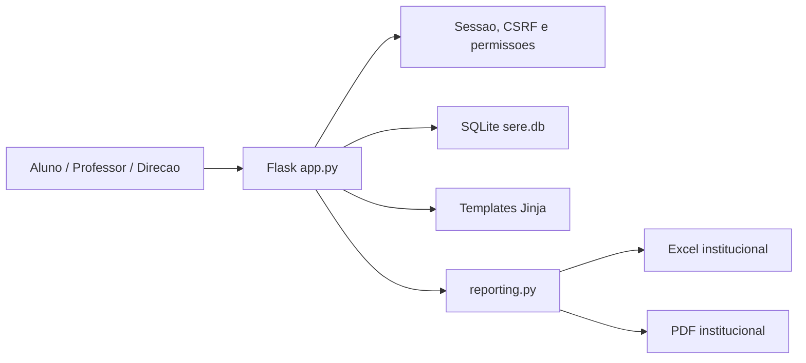

# Arquitetura do SERE

## Visao geral

O SERE e uma aplicacao Flask com banco SQLite, telas server-rendered em Jinja e exportacao institucional em PDF/XLSX.

## Camadas atuais

- `app.py`: rotas, regras pedagogicas, seeds, consultas e a maior parte da logica de produto.
- `database.py`: conexao SQLite com commit, rollback e fechamento seguro.
- `security.py`: politicas de senha, acoes permitidas no painel e bloqueio de login.
- `reporting.py`: exportacao sem dependencia externa para PDF e XLSX.
- `sere/services/scoring.py`: calculo de indice, conceito e classes.
- `templates/`: paginas HTML server-rendered.
- `static/`: CSS e imagens.
- `tests/`: cobertura de permissoes, relatorios, rotina, intervencoes e seguranca.

## Permissoes

- Aluno: ve dashboard, ranking, perfis publicos, metas, rotina, recomendacoes e comprovacoes proprias.
- Professor: ve relatorios, intervencoes e painel, mas alteracoes viram solicitacoes.
- Admin/direcao: aprova solicitacoes e tem controle total de gestao.

## Modulos futuros

- Persistencia em PostgreSQL.
- Separacao de `app.py` em blueprints (`auth`, `students`, `ranking`, `reports`, `admin`).
- Jobs de backup e logs de auditoria mais completos.
- Prototipos experimentais permanecem arquivados fora da experiencia principal.
